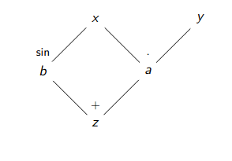

---
jupytext:
  cell_metadata_filter: -all
  formats: md:myst
  text_representation:
    extension: .md
    format_name: myst
kernelspec:
  display_name: Python 3 (ipykernel)
  language: python
  name: python3
---
# Introducción al aprendizaje profundo basado en la física

```{contents}
:local:
```

## De modelos basados en los datos a basados en la física

El aprendizaje profundo ha demostrado ser una herramienta poderosa para abordar problemas complejos en diversas áreas, desde la visión por computadora hasta el procesamiento del lenguaje natural. Sin embargo, a medida que se amplían las aplicaciones de estas técnicas, surge la necesidad de integrar conocimientos específicos de dominio en los modelos para mejorar su precisión y eficiencia. En el contexto de la física y otras ciencias naturales, los modelos basados únicamente en datos pueden no capturar adecuadamente las leyes fundamentales que rigen los fenómenos estudiados. Aquí es donde entran en juego las Redes Neuronales Basadas en la Física (PINNs, por sus siglas en inglés).

Las PINNs representan un enfoque innovador que combina el poder del aprendizaje profundo con principios físicos bien establecidos. A diferencia de los modelos tradicionales de aprendizaje profundo, que dependen exclusivamente de grandes volúmenes de datos para aprender patrones, las PINNs incorporan ecuaciones diferenciales parciales (PDEs) y otras leyes físicas directamente en el proceso de entrenamiento. Esto no solo mejora la capacidad del modelo para generalizar a partir de datos limitados, sino que también garantiza que las predicciones respeten las restricciones físicas inherentes al problema. La motivación para avanzar hacia las PINNs radica en su potencial para resolver problemas complejos en áreas como la dinámica de fluidos, la mecánica cuántica y la biología computacional, donde las simulaciones precisas y eficientes son cruciales. Al integrar el conocimiento físico en el aprendizaje profundo, las PINNs ofrecen una nueva perspectiva para abordar desafíos científicos, permitiendo modelos que no solo son precisos, sino también interpretables y consistentes con las leyes de la naturaleza.

En el aprendizaje profundo basado en la física, se extiende la idea de función de costo de manera natural. En este caso, se combinan términos asociados a los datos con términos que miden el incumplimiento de las leyes físicas, típicamente expresadas mediante ecuaciones diferenciales, condiciones iniciales y de frontera, o principios variacionales. De forma esquemática, la función de costo adopta la forma 

$$
\mathcal{L} = \mathcal{L}_{\text{datos}} + \lambda \mathcal{L}_{\text{física}}
$$

donde el segundo término penaliza las desviaciones respecto a las ecucaciones que gobiernan el sistema y $\lambda$ controla elbalance entre ajuste a los datos y la consistencia física de la solución. 

Este enfoque unifica el aprendizaje automática con el modelado físico en un único marco de optimización, en el que las redes neuronales actúan como aproximadores universales, mientras que la función de costo garantiza que las soluciones aprendidas respeten la estructura fundamental del problema en cuestión. 


## Evolución de aprendizaje automático a aprendizaje profundo


El aprendizaje profundo es una subdisciplina del aprendizaje automático que ha revolucionado la forma en que abordamos problemas complejos de análisis de datos y modelado. Se caracteriza por el uso de redes neuronales artificiales con múltiples capas, conocidas como redes neuronales profundas, que son capaces de aprender representaciones jerárquicas de los datos. A diferencia de los métodos tradicionales de aprendizaje automático, que a menudo requieren de un preprocesamiento intensivo y la extracción manual de características, el aprendizaje profundo permite que los modelos descubran automáticamente las características relevantes directamente a partir de los datos brutos. Este avance ha sido posible gracias a mejoras en algoritmos de optimización, la disponibilidad de grandes conjuntos de datos y el incremento del poder computacional, especialmente a través del uso de unidades de procesamiento gráfico (GPUs).

El término "profundo" en aprendizaje profundo se refiere a la presencia de múltiples capas ocultas en una red neuronal, lo que permite al modelo aprender características de alto nivel de los datos de manera progresiva. Históricamente, el concepto de redes neuronales se remonta a mediados del siglo XX, pero fue en la última década que el aprendizaje profundo ganó prominencia, impulsado por avances como las redes neuronales convolucionales (CNNs) para el procesamiento de imágenes y las redes neuronales recurrentes (RNNs) para el procesamiento del lenguaje natural. Modelos como AlexNet, que ganó el concurso ImageNet en 2012, demostraron el poder de las CNNs para tareas de visión por computadora, mientras que las RNNs y sus variantes, como las redes LSTM, han sido fundamentales para el análisis de secuencias temporales. Más recientemente, los transformadores han revolucionado el campo del procesamiento del lenguaje natural, permitiendo el desarrollo de modelos como BERT y GPT, que han establecido nuevos estándares en tareas de comprensión y generación de texto. Estos modelos han ampliado las fronteras de lo que es posible en inteligencia artificial, permitiendo aplicaciones innovadoras en áreas como la visión por computadora, el reconocimiento de voz y la traducción automática.

En lo que continúa revisaremos algunos de los conceptos para mí más importantes que permitieron avanzar del aprendizaje automático al aprendizaje profundo y que nos serán de utilidad para entender los modelos que plantearemos más adelante.

### Diferenciación Automática y retropropagación

Como he mencionado anteriormente, el entrenamiento de modelos de aprendizaje automático profundo se basa en el cálculo eficiente del gradiente de la función (escalar) de costo $\mathcal{L}(\theta)$ con respecto a un gran número de parámetros $\theta$, i.e. $\theta \in \mathbf{R}^n$ con $n$ grande. Los algoritmos de optimización requieren el gradiente $\nabla_{\theta}\mathcal{L}$ para actualizar los parámetros de forma iterativa, pero el cálculo manual de estos gradientes resulta impracticable para modelos reales. 

La **diferenciación automática** (Autograd) es una técnica computacional que permite calcular derivadas exactas (hasta la precisión de la máquina) de funciones definidas programáticamente de manera eficiente y sistemática. A diferencia de la diferenciación simbólica o de la numérica, la automática o autograd se basa en la aplicación repetida de la regla de la cadena sobre operaciones elementales.

La base del Autograd es el grafo computacional. Cualquier función implementada como una secuencia de operaciones elementales (suma, producto, exponencial, etc.) puede representarse como un grafo dirigido acíclico donde los nodos representan operaciones o variables intermedias y las aristas representan dependencias funcionales. Por ejemplo, $f(x,y)=xy + sin(x)$ puede considerarse como $f(a,b)=z=a+b$ con $a=xy$ y $b=sin(x)$ y el grafo puede ser representado como se muestra en la siguiente figura.



Si aplicamos la regla de la cadena para una variable $t$ (que puede ser $x$ o $y$), podemos escribir lo siguiente

$$
\frac{\partial z}{\partial t} = \frac{\partial a}{\partial t} + \frac{\partial b}{\partial t}
$$

con 

$$
\frac{\partial b}{\partial t} = \cos(x) \frac{\partial x}{\partial t} 
$$

y

$$
\frac{\partial a}{\partial t} = x\frac{\partial y}{\partial t} + y\frac{\partial x}{\partial t}
$$

Si escribimos estas expresiones en un programita que involucra variables diferenciales $(dx, dy)$ nos queda

```python
da = y * dx + x*dy
db = cos(x) * dx
dz = da + db
```

Si queremos saber la derivada para $x$ basta con remplazar $dx=1$ y $dy=0$ y viceversa para la derivada con respecto a $y$.  Así empiezan a aparecer unas reglas básicas programáticas, como por ejemplo, si $c=a+b$ (suma) entonces $dc=da+db$. Si $c=a*b$, entonces $dc=b*da + a*db$, y si $c=sin(a)$ entonces $dc=cos(a)*da$. De la misma manera, podemos armarnos de las reglas para la resta, la división, la exponenciación, el coseno y la tangente (entre otras más).

La diferenciación automática se puede hacer de dos maneras, hacia adelante o hacia atrás (retropropagación) pero a continuación daré argumentos de por qué se utiliza la diferenciación hacia atrás en aprendizaje profundo. Hacia adelante sería: El programa lee $x$ y $dx$, $y$ y $dy$. En este ejemplo $a=x*y$, por lo que con las reglas que obtuvimos $da=y*dx + x*dy$. Como $b=sin(x)$, por la regla que obtuvimos $db=cos(x) +dx$. Finalmente, como $z=a+b$, por la regla de la suma $dz=da+db$. De esta manera, si $dx=1$ y $dy=0$, se obtiene la derivada de la función $z$ con respecto a $x$ computacionalmente. A pesar de que la diferenciación automática hacia adelante resulta muy fácil de implementar y entender, presenta una gran desventaja computacional. Para CADA variable sobre la que queremos calcular el gradiente, debemos correr el programa que realiza toda la computación desde el inicio hasta el fin. Esto claramente representa un problema gigante para las redes neuronales profundas (que pueden presentar más de millones de parámetros).

La solución a este problema es la diferenciación automática hacia atrás o bien la retropropagación del gradiente y se basa en revertir la regla de la cadena. En este caso, en vez de preguntarnos cómo varía la salida en función de las variables de entrada, nos preguntamos qué variables de salida pueden ser afectadas por una variable entrada dada. Así como usamos $t$ para expresar una variable genérica de entrada anteriormente, usando $s$ para una variable genérica de salida se puede escribir 

$$
\frac{\partial s}{\partial b} = \frac{\partial z}{\partial b}\frac{\partial s}{\partial z} = \frac{\partial s}{\partial z}
$$

$$
\frac{\partial s}{\partial a} = \frac{\partial z}{\partial a}\frac{\partial s}{\partial z} = \frac{\partial s}{\partial z}
$$

$$
\frac{\partial s}{\partial y} = \frac{\partial a}{\partial y}\frac{\partial s}{\partial a} = x\frac{\partial s}{\partial a}
$$

$$
\frac{\partial s}{\partial x} = \frac{\partial a}{\partial x}\frac{\partial s}{\partial a} + \frac{\partial b}{\partial x}\frac{\partial s}{\partial b}=y\frac{\partial s}{\partial a} + cos(x)\frac{\partial s}{\partial b}=(y+cos(x))\frac{\partial s}{\partial z}
$$

Escribiendo lo anterior en un programita, esto nos queda

```python
gb = gz
ga = gz
gy = x * ga
gx = y * ga + cos(x) * gb
```

Sustituyendo $s=z$ sería equivalente a $gz=1$, podemos ver entonces que para calcular ambos gradientes $\frac{\partial z}{\partial x}$ y $\frac{\partial z}{\partial y}$ debemos ejecutar el programa **una sola vez**.


Continuar...

### Conexiones residuales

A medida que las redes neuronales profundas comenzaron a escalar en número de capas, se observó un fenómeno paradójico. Al incrementar la profundidad del modelo, el desempeño en entrenamiento y validación podía verse afectado negativamente. Aún cuando el modelo más profundo tenía mayor capacidad expresiva que uno más superficial, no se osbervaban mejoras. Y esto no se debía al sobreajuste sino a una dificultad inherente en el proceso de optimización. 

Una de las causas principales de este fenómeno fue la atenuación o explosión del gradiente durante la retropropagación. En redes neuronales muy profundas, los gradientes pueden volverse extremadamente pequeños o grandes al atravesar muchas capas consecutivas, lo que dificulta el ajuste efectivo de los parámetros de las primeras capas. Las primeras ideas para mitigar este problema fueron la normalización de los datos por batches y comenzar con una inicialización adecuada de los pesos del modelo. A pesar de que esto tuvo un efecto positivo sobre el aprendizaje de los modelos profundo, no resultó suficiente para permitir entrenamiento estable de redes extremadamente profundas. 

lo que permitió destrabar este problema fueron las conexiones residuales, que fueron introducidas originalmente en las redes ResNet {cite}`he2015deepresiduallearningimage`. La idea principal consiste en reformular la red en bloques. En lugar de aprender directamente una transformación deseada $H(x)$ de la entrada $x$, cada bloque aprende una función residual $F(x)$ definida como 

$$
F(x) = H(x) -x,
$$

de modo que la salida del bloque se expresa como

$$
y = x + F(x)
$$

En términos prácticos, la implementación es una conexión directa que salta una o más capas (fijarse que y=x es parte de la transformación) y suma la entrada del bloque con su salida transformada. Efectivamente es incluir la identidad a la transformación lo cual no introduce parámetros adicionales, pero permite que no desaparezca el gradiente. 

Desde el punto de vista de optimización, las conexiones residuales facilitan el aprendizaje al permitir que el modelo ajuste perturbaciones pequeñas alrededor de la identidad. Si la transformación óptima es cercana a la identidad, el modelo la aproxima más facilmente aprendiendo un residual cercano a cero, en vez de forzar a las capas a aprender explícitamente una identidad completa mediante funciones no lineales. 

Además, las conexiones residuales crean cortecamino para el flujo del gradiente durante la retropropagación. Al derivar la salida de un bloque con respecto a su entrada, se obtiene

$$
\frac{\partial y}{\partial x} = I + \frac{\partial F(x)}{\partial x},
$$

donde $I$ es la identidad. Este término garantiza que, incluso si el gradiente asociado a $F(x)$ se atenúa, existe siempre una contribución directa que preserva la señal del gradiente a lo largo de la red. Como consecuencia, el gradiente se propaga de manera más estable hacia las capas más profundas (es decir, a las primeras capas ya que estamos retropropagando el gradiente).


La introducción de conexiones residuales marcó un punto de inflexión en el desarrollo del aprendizaje profundo. Esto condujo a mejoras directas y sustanciales en tareas de visión por computadora, reconocimiento de patrones y modelado de sistemas complejos.  Más allá de su formulación original, el rpincipio residual ha sido adoptado y extendido en múltiples arquitecturas modernas, incluyendo redes densas, transformadores y modelos utilizandos en aprendizajo profundo basado en la física. 


### Clasificación de imágenes 

La clasificación de imágenes constitute una de las aplicaciones más representativas y exitosas del aprendizaje profundo {cite}`yu2023`. El problema consiste en asignar a una imagen una etiqueta discreta que describe su contenido, como la presencia de un objeto, un estado físico o una categoría predefinida. Desde un punto de vista formal, una imagen puede interpretarse como una función discreta definida sobre una grilla bidimensional, cuyos valores representan intensidades, colores o magnitudes físicas medidas en el espacio.

Antes de la irrupción del aprendizaje profundo, los métodos de clasificación de imágenes dependían en gran medida de la extracción manual de características, tales como bordes, texturas o descriptores geométricos diseñados específicamente para cada dominio. Estos enfoques requerían un conocimiento experto considerable y presentaban limitaciones importantes al enfrentarse a variaciones complejas en escala, orientación, ruido o condiciones de adquisición.

El aprendizaje profundo transformó radicalmente este panorama mediante el uso de redes neuronales profundas capaces de aprender representaciones jerárquicas directamente a partir de los datos. En particular, las redes neuronales convolucionales introdujeron una estructura inductiva que explota la localización espacial y la invariancia traslacional inherentes a las imágenes. A través de la composición de múltiples capas convolucionales y no lineales, estos modelos aprenden progresivamente características de bajo nivel, como bordes y contrastes, y las combinan para formar descriptores de alto nivel relevantes para la tarea de clasificación.

Desde el punto de vista matemático, la clasificación de imágenes se formula como un problema de optimización en el que se busca ajustar los parámetros del modelo para minimizar una función de costo que mide la discrepancia entre las etiquetas verdaderas y las predicciones del modelo. El entrenamiento se realiza mediante retropropagación y optimización basada en gradientes, apoyándose en técnicas como normalización, regularización y arquitecturas profundas para garantizar estabilidad y buen desempeño.

En el contexto del aprendizaje profundo basado en la física, la clasificación de imágenes adquiere un significado adicional. En muchas aplicaciones científicas, las imágenes no son meramente representaciones visuales, sino mediciones de campos físicos, distribuciones de energía, densidades de probabilidad o estados del sistema bajo estudio. Ejemplos típicos incluyen imágenes médicas, patrones experimentales, simulaciones numéricas de campos físicos y datos obtenidos mediante sensores especializados.

```{code-cell} ipython3
:toggle:

import torch
import torch.nn as nn
import torch.nn.functional as F
from torch.utils.data import DataLoader
from torchvision import datasets, transforms
import random
import matplotlib.pyplot as plt

# -----------------------------
# Configuración básica
# -----------------------------
device = "cuda" if torch.cuda.is_available() else "cpu"
torch.manual_seed(0)

batch_size = 128
lr = 1e-3
epochs = 3

# -----------------------------
# Datos: Fashion-MNIST (28x28)
# -----------------------------
transform = transforms.Compose([
    transforms.ToTensor(),  # [0,1], shape: (1,28,28)
])

train_ds = datasets.FashionMNIST(root="./data", train=True, download=True, transform=transform)
test_ds  = datasets.FashionMNIST(root="./data", train=False, download=True, transform=transform)

train_loader = DataLoader(train_ds, batch_size=batch_size, shuffle=True, num_workers=2, pin_memory=True)
test_loader  = DataLoader(test_ds, batch_size=batch_size, shuffle=False, num_workers=2, pin_memory=True)

# -----------------------------
# Modelo: CNN pequeña (rápida y suficiente)
# -----------------------------
class SmallCNN(nn.Module):
    def __init__(self):
        super().__init__()
        self.conv1 = nn.Conv2d(1, 16, kernel_size=3, padding=1)   # 28x28 -> 28x28
        self.conv2 = nn.Conv2d(16, 32, kernel_size=3, padding=1)  # 14x14 -> 14x14
        self.fc1 = nn.Linear(32 * 7 * 7, 128)
        self.fc2 = nn.Linear(128, 10)  # 10 clases

    def forward(self, x):
        x = F.relu(self.conv1(x))
        x = F.max_pool2d(x, 2)         # 28x28 -> 14x14
        x = F.relu(self.conv2(x))
        x = F.max_pool2d(x, 2)         # 14x14 -> 7x7
        x = x.view(x.size(0), -1)      # flatten
        x = F.relu(self.fc1(x))
        return self.fc2(x)             # logits

model = SmallCNN().to(device)

# Pérdida y optimizador
criterion = nn.CrossEntropyLoss()
optimizer = torch.optim.Adam(model.parameters(), lr=lr)

# -----------------------------
# Entrenamiento
# -----------------------------
def accuracy(loader):
    model.eval()
    correct = 0
    total = 0
    with torch.no_grad():
        for x, y in loader:
            x, y = x.to(device), y.to(device)
            logits = model(x)
            pred = logits.argmax(dim=1)
            correct += (pred == y).sum().item()
            total += y.numel()
    model.train()
    return correct / total

for epoch in range(1, epochs + 1):
    running_loss = 0.0
    for x, y in train_loader:
        x, y = x.to(device), y.to(device)

        optimizer.zero_grad()
        logits = model(x)
        loss = criterion(logits, y)
        loss.backward()
        optimizer.step()

        running_loss += loss.item() * x.size(0)

    train_loss = running_loss / len(train_ds)
    test_acc = accuracy(test_loader)

    print(f"Epoch {epoch}/{epochs} | loss: {train_loss:.4f} | test acc: {test_acc:.4f}")

# -----------------------------
# (Opcional) Mapa de clases
# -----------------------------
classes = ["Remera","Pantalón","Pulover","Vestido","Abrigo","Sandalia","Camisa","Zapatilla","Bolso","Bota"]

model.eval().cpu()

# Elegir 10 imágenes aleatorias del conjunto de test
indices = random.sample(range(len(test_ds)), 10)

plt.figure(figsize=(12, 5))

for i, idx in enumerate(indices):
    x, y_true = test_ds[idx]

    with torch.no_grad():
        logits = model(x.unsqueeze(0))
        y_pred = logits.argmax(dim=1).item()

    plt.subplot(2, 5, i + 1)
    plt.imshow(x.squeeze(), cmap="gray")
    plt.title(f"Pred:{classes[y_pred]}")
    plt.axis("off")

plt.suptitle("Clasificación de imágenes de ropa (Fashion-MNIST)")
plt.tight_layout()
plt.show()
```
### Modelos de regresión 

Los problemas de regresión constituyen una de las tareas fundamentales del aprendizaje automático y del aprendizaje profundo. En este tipo de problemas, el objetivo es aproximar una relación funcional entre un conjunto de variables de entrada y una o más variables de salida continuas. A diferencia de la clasificación, donde se asignan etiquetas discretas, la regresión busca predecir magnitudes reales que suelen representar cantidades físicas, estados del sistema o variables observables de interés.

El aprendizaje profundo amplía de manera significativa el alcance de los modelos de regresión clásicos mediante el uso de redes neuronales profundas como aproximadores universales de funciones. Al componer múltiples capas no lineales, estas redes son capaces de capturar dependencias complejas entre variables de entrada y salida, sin necesidad de especificar explícitamente la forma funcional de la relación subyacente. Desde un punto de vista matemático, el problema se formula como la minimización de una función de costo que mide el error entre las predicciones del modelo y los valores continuos observados, típicamente mediante métricas como el error cuadrático medio u otras funciones robustas.

En aplicaciones científicas y de ingeniería, los modelos de regresión con aprendizaje profundo se utilizan para aproximar campos físicos, resolver problemas inversos, emular simulaciones numéricas costosas y predecir la evolución temporal de sistemas dinámicos. En muchos de estos casos, las salidas del modelo no son simples valores escalares, sino funciones continuas en el espacio y el tiempo, lo que resalta el carácter funcional de la regresión en este contexto.


```{code-cell} ipython3
import math
import numpy as np
import torch
import torch.nn as nn
import matplotlib.pyplot as plt

# ---------------------------
# Dataset de oscilador sintético
# ---------------------------
rng = np.random.default_rng(0)

A = 1.0       # amplitud
gamma = 0.15  # amortiguamiento (γ)
omega = 2.5   # frecuencia angular (ω)
phi = 0.4     # fase (φ)

def x_true(t):
    return A * np.exp(-gamma * t) * np.cos(omega * t + phi)

N = 800
t = rng.uniform(0.0, 10.0, size=(N, 1)).astype(np.float32)
y = x_true(t).astype(np.float32)

noise_std = 0.05
y_noisy = y + noise_std * rng.normal(size=y.shape).astype(np.float32)

# Train/test split
idx = rng.permutation(N)
n_train = int(0.8 * N)
train_idx, test_idx = idx[:n_train], idx[n_train:]

t_train, y_train = t[train_idx], y_noisy[train_idx]
t_test,  y_test  = t[test_idx],  y_noisy[test_idx]

# Estandarizar entrada (t) ayuda al entrenamiento
t_mean, t_std = t_train.mean(axis=0, keepdims=True), t_train.std(axis=0, keepdims=True) + 1e-8
t_train_s = (t_train - t_mean) / t_std
t_test_s  = (t_test  - t_mean) / t_std

# Tensores
t_train_t = torch.from_numpy(t_train_s)
y_train_t = torch.from_numpy(y_train)
t_test_t  = torch.from_numpy(t_test_s)
y_test_t  = torch.from_numpy(y_test)

# ---------------------------
# Modelo MLP de regresión
# ---------------------------
class MLP(nn.Module):
    def __init__(self):
        super().__init__()
        self.net = nn.Sequential(
            nn.Linear(1, 64),
            nn.Tanh(),
            nn.Linear(64, 64),
            nn.Tanh(),
            nn.Linear(64, 1),
        )

    def forward(self, x):
        return self.net(x)

torch.manual_seed(0)
model = MLP()

criterion = nn.MSELoss()
optimizer = torch.optim.Adam(model.parameters(), lr=1e-3)

# ---------------------------
# Entrenamiento
# ---------------------------
batch_size = 128
epochs = 1500

for epoch in range(1, epochs + 1):
    # mini-batch simple
    perm = torch.randperm(t_train_t.size(0))
    for i in range(0, t_train_t.size(0), batch_size):
        idxb = perm[i:i+batch_size]
        xb = t_train_t[idxb]
        yb = y_train_t[idxb]

        optimizer.zero_grad()
        pred = model(xb)
        loss = criterion(pred, yb)
        loss.backward()
        optimizer.step()

    if epoch in {1, 200, 500, 1000, 1500}:
        with torch.no_grad():
            test_pred = model(t_test_t)
            rmse = torch.sqrt(torch.mean((test_pred - y_test_t) ** 2)).item()
        print(f"Epoch {epoch:4d} | Test RMSE: {rmse:.4f}")

# ---------------------------
# Visualización
# ---------------------------
# Curva ordenada en el tiempo para graficar suave
t_grid = np.linspace(0.0, 10.0, 600, dtype=np.float32).reshape(-1, 1)

t_extra = np.linspace(0.0, 15.0, 700, dtype=np.float32).reshape(-1, 1)
t_extra_s = (t_extra - t_mean) / t_std

with torch.no_grad():
    y_grid_pred = model(torch.from_numpy(t_extra_s)).numpy()

plt.figure()
plt.scatter(t_train, y_train, s=10, alpha=0.5, label="Datos entrenamiento")
plt.scatter(t_test,  y_test,  s=10, alpha=0.5, label="Datos prueba")
plt.plot(t_extra, x_true(t_extra), '-', c="black", label="Solución analítica")
plt.plot(t_extra, y_grid_pred, 'r-', label="Predicción")
plt.xlabel("t")
plt.ylabel("x(t)")
plt.title("Regresión con MLP: oscilador amortiguado")
plt.legend()
plt.show()
```

Al igual que en el caso anterior, muestro la solución analítica y la predicción tanto para el dominio de los datos de entrenamiento como para un intervalo fuera del rango, es decir de predicción por extrapolación. Como se puede obersvar, el modelo de aprendizaje automático aprende correctamente y con alta precisión dentro del dominio de entrenamiento pero luego funciona incorrectamente fuera. Esto se da independientemente de haber utilizado una partición de datos de entrenamiento como de prueba. Más adelante, veremos como con una red neuronal basada en la física (PINN) podremos encontrar una mejor solución a este problema en particular. Además, en la siguiente sección veremos cómo conviene utilizar otro enfoque cuando se tienen series temporales. 

### Redes Neuronales Recurrentes

Muchos problemas relevantes en ciencia e ingeniería no pueden describirse adecuadamente como relaciones estáticas entre variables, sino que involucran dependencias temporales y evolución dinámica. En estos escenarios, los datos se presentan naturalmente como secuencias, ya sea en el tiempo, en el espacio o en ambos. Las redes neuronales recurrentes (RNN, por sus siglas en inglés) surgen como una extensión del aprendizaje profundo diseñada específicamente para modelar este tipo de estructuras secuenciales.

A diferencia de las redes neuronales feedforward, que procesan cada entrada de manera independiente, las RNN incorporan un estado interno que actúa como una memoria dinámica. Este estado permite que la salida del modelo en un instante dado dependa no solo de la entrada actual, sino también del historial previo. Desde un punto de vista matemático, una RNN define una relación recursiva en la que el estado oculto se actualiza en cada paso temporal mediante una transformación no lineal que combina la entrada presente con el estado anterior.

El entrenamiento de redes neuronales recurrentes se realiza mediante una extensión de la retropropagación conocida como retropropagación a través del tiempo. Este procedimiento desenrolla la recurrencia a lo largo de la dimensión temporal y permite calcular gradientes con respecto a los parámetros compartidos en todos los pasos. Sin embargo, la naturaleza recursiva de estas arquitecturas introduce desafíos adicionales, como la atenuación y explosión de gradientes, que limitan la capacidad de las RNN clásicas para capturar dependencias de largo alcance.

Para abordar estas dificultades, se desarrollaron variantes como las redes de memoria a largo y corto plazo (LSTM) y las unidades recurrentes con compuertas (GRU). Estas arquitecturas introducen mecanismos de control que regulan el flujo de información y gradientes a lo largo del tiempo, permitiendo aprender dependencias temporales más largas y estables. Gracias a estas mejoras, las redes neuronales recurrentes se han convertido en herramientas fundamentales para el modelado de series temporales, señales dinámicas y procesos secuenciales complejos.

Abordemos el mismo problema anterior, pero esta vez con una GRU.

```{code-cell} ipython3

import numpy as np
import torch
import torch.nn as nn
import matplotlib.pyplot as plt

rng = np.random.default_rng(0)

A = 1.0       # amplitud
gamma = 0.15  # amortiguamiento (γ)
omega = 2.5   # frecuencia angular (ω)
phi = 0.4     # fase (φ)

def x_true(t):
    return A * np.exp(-gamma * t) * np.cos(omega * t + phi)

N = 800
t = np.linspace(0.0, 10.0, N).astype(np.float32)
x_clean = x_true(t).astype(np.float32)

noise_std = 0.05
x = x_clean + noise_std * rng.normal(size=x_clean.shape).astype(np.float32)


# Normalización (muy útil en RNNs)
x_mean, x_std = x.mean(), x.std() + 1e-8
x_n = (x - x_mean) / x_std
x_clean_n = (x_clean - x_mean) / x_std

# ---------------------------
# Construir dataset de ventanas (secuencias)
# ---------------------------
# Usamos una ventana de longitud L para predecir el siguiente punto.
L = 50  # longitud de contexto

def make_windows(series, L):
    X, Y = [], []
    for i in range(len(series) - L):
        X.append(series[i:i+L])
        Y.append(series[i+L])
    return np.array(X, dtype=np.float32), np.array(Y, dtype=np.float32)

X_all, y_all = make_windows(x_n, L)  # X_all: (N, L), y_all: (N,)

# Train/test split respetando el orden temporal
N = X_all.shape[0]
n_train = int(0.8 * N)

X_train, y_train = X_all[:n_train], y_all[:n_train]
X_test,  y_test  = X_all[n_train:], y_all[n_train:]

# Tensores: RNN espera (batch, seq_len, features)
X_train_t = torch.from_numpy(X_train).unsqueeze(-1)  # (N, L, 1)
y_train_t = torch.from_numpy(y_train).unsqueeze(-1)  # (N, 1)
X_test_t  = torch.from_numpy(X_test).unsqueeze(-1)
y_test_t  = torch.from_numpy(y_test).unsqueeze(-1)

# ---------------------------
# Modelo recurrente (GRU)
# ---------------------------
class GRURegressor(nn.Module):
    def __init__(self, hidden_size=32, num_layers=1):
        super().__init__()
        self.rnn = nn.GRU(
            input_size=1,
            hidden_size=hidden_size,
            num_layers=num_layers,
            batch_first=True
        )
        self.head = nn.Linear(hidden_size, 1)

    def forward(self, x):
        # x: (B, L, 1)
        out, _ = self.rnn(x)          # out: (B, L, H)
        h_last = out[:, -1, :]        # último estado oculto: (B, H)
        y_hat = self.head(h_last)     # (B, 1)
        return y_hat

torch.manual_seed(0)
model = GRURegressor(hidden_size=64)

criterion = nn.MSELoss()
optimizer = torch.optim.Adam(model.parameters(), lr=1e-3)

# ---------------------------
# Entrenamiento
# ---------------------------
batch_size = 128
epochs = 30

def iterate_minibatches(X, y, bs):
    idx = torch.randperm(X.size(0))
    for i in range(0, X.size(0), bs):
        j = idx[i:i+bs]
        yield X[j], y[j]

for epoch in range(1, epochs + 1):
    model.train()
    for xb, yb in iterate_minibatches(X_train_t, y_train_t, batch_size):
        optimizer.zero_grad()
        pred = model(xb)
        loss = criterion(pred, yb)
        loss.backward()
        optimizer.step()

    if epoch in {1, 5, 10, 20, 30}:
        model.eval()
        with torch.no_grad():
            pred_test = model(X_test_t)
            rmse = torch.sqrt(torch.mean((pred_test - y_test_t) ** 2)).item()
        print(f"Epoch {epoch:2d} | Test RMSE (norm): {rmse:.4f}")

# ---------------------------
# Visualización: predicción vs real en el tramo de test
# ---------------------------
model.eval()
with torch.no_grad():
    yhat_test = model(X_test_t).squeeze(-1).numpy()  # normalizado
    y_test_np = y_test_t.squeeze(-1).numpy()

# Desnormalizar para graficar en unidades originales
yhat_test_u = yhat_test * x_std + x_mean
y_test_u    = y_test_np  * x_std + x_mean

# Para alinear tiempos: y_test corresponde a t[L + n_train : ...]
t_test = t[L + n_train : L + n_train + len(y_test_u)]

plt.figure()
plt.plot(t, x_clean, label="Señal física (sin ruido)")
plt.plot(t, x, alpha=0.4, label="Observaciones (con ruido)")
plt.plot(t_test, y_test_u, label="Valor real (test)")
plt.plot(t_test, yhat_test_u, label="Predicción GRU (test)")
plt.xlabel("t")
plt.ylabel("x(t)")
plt.title("Predicción one-step-ahead con GRU: oscilador amortiguado")
plt.legend()
plt.show()
```

## Sesgos inductivos y constraints físicos

Todo modelo de aprendizaje automático incorpora, de manera explícita o implícita, un conjunto de supuestos sobre el tipo de funciones que es capaz de aprender. Estos supuestos, conocidos como sesgos inductivos, determinan cómo el modelo generaliza más allá de los datos observados y juegan un papel central cuando la información disponible es limitada, ruidosa o incompleta.

En aprendizaje profundo, los sesgos inductivos se introducen principalmente a través de la arquitectura del modelo, la función de costo y el procedimiento de optimización. Por ejemplo, las redes convolucionales imponen un sesgo de localidad y de invariancia traslacional; las redes recurrentes introducen un sesgo temporal; y las conexiones residuales favorecen transformaciones cercanas a la identidad. Estos sesgos no garantizan por sí mismos que el modelo aprenda la “función correcta”, pero restringen el espacio de hipótesis de una manera que hace el aprendizaje más eficiente y estable.

En muchos problemas científicos y de ingeniería, además de los datos, se dispone de un conocimiento sustancial sobre el sistema bajo estudio. Este conocimiento se expresa típicamente en forma de leyes físicas, como ecuaciones diferenciales, principios de conservación, simetrías, restricciones de positividad o límites energéticos. Ignorar esta información y entrenar modelos puramente basados en datos no solo puede resultar ineficiente, sino que puede conducir a soluciones que, aunque ajusten los datos observados, violan principios fundamentales y carecen de significado físico. Desde este punto de vista, podemos considerar a los constraints físicos como sesgos inductivos basados en la física. Al incorporarlos explícitamente en el proceso de aprendizaje, se restringe el espacio de soluciones admisibles a aquellas que son compatibles con las leyes del sistema. 

Existen múltiples formas de introducir constraints físicos en modelos de aprendizaje profundo. Se puede modificar la arquitectura para respetar simetrías o estructuras conocidas. Se pueden imponer condiciones de frontera e iniciales y la inclusión de términos adicionales en la función de costo para penalizar el incumplimiento de ecuaciones físicas (veremos esto en más detalle en las redenes neuronales basadas en la física (PINNs)).

Este enfoque cambia conceptualmente la idea. En vez de pensar al modelo como caja negra que extrae patrones de los datos, se lo piensa como un aproximador funcional restringido por conocimiento previo. 

Un ejemplo de un constraint establecido por cambio de arquitectura sencillo puede ser el de la positividad de la solución. Supongamos que tenemos un conjunto de datos dados por 

$$
y = exp(x) + 0.05 \epsilon
$$

```{code-cell} ipython3
import torch

# Datos sintéticos: y = exp(x) + ruido (siempre positivo)
N = 512
x = torch.linspace(-2, 2, N).unsqueeze(1)
y_true = torch.exp(x) + 0.05 * torch.randn_like(x)
```

donde $\epsilon \sim N(0,1)$ representa un ruido aleatorio. En este caso, la solución siempre deberia ser positiva. Podemos plantear un perceptrón múltiple (MLP) para este problema, con 3 capas de 64 neuronas cada una, completamente conectadas. En el código a continuación, implementaremos el perceptrón múltiple con y sin el constraint y veremos qué sucede en cada caso. El constraint será impuesto mediante una función *Softplus* sobre la capa de salida. La función Softplus siempre resulta positiva y se escribe como

$$
Softplus(x) = \log(1+\exp(x)) 
$$

Esta función ya viene provista por el paquete `PyTorch` dentro del módulo `torch.nn.functional`. En principio se podría utilizar cualquier función que sea siempre positiva para esto. Pero esta función tiene varias ventajas en el proceso de aprendizaje. Por un lado, no pierde la información del signo (elevar al cuadrado si). Por otro evita explosiones del gradiente al aplicar exponencial y logaritmo (sólo aplicar exponencial puede hacer que explote el gradiente y se vuelva difícil o imposible de entrenar). Además, es diferenciable (donde una función como la ReLU no lo es en todo su dominio). Todas estas consideraciones son importantes de tener en cuenta a la hora de elegir cómo se modificará la arquitectura de la red. 

Procedemos a plantear ambos modelos, donde se debe observar

```{code-cell} ipython3
import torch.nn as nn
import torch.nn.functional as F
import matplotlib.pyplot as plt


torch.manual_seed(0)

class MLP(nn.Module):
    def __init__(self, in_dim=1, hidden_dim=64, out_dim=1, softplus=True):
        super().__init__()
        self.net = nn.Sequential(
            nn.Linear(in_dim, hidden_dim),
            nn.Tanh(),
            nn.Linear(hidden_dim, hidden_dim),
            nn.Tanh(),
            nn.Linear(hidden_dim, out_dim),
        )
        self.softplus = softplus

    def forward(self, x):
        if self.softplus:
            return F.softplus(self.net(x))
        else:
            return self.net(x)

mlp = MLP(softplus=False)
mlp_constraint = MLP(softplus=True)


opt = torch.optim.Adam(mlp.parameters(), lr=1e-2)
opt2 = torch.optim.Adam(mlp_constraint.parameters(), lr=1e-2)

# Entrenamiento simple
for epoch in range(500):
    opt.zero_grad()
    y_pred = mlp(x)
    loss = F.mse_loss(y_pred, y_true)
    loss.backward()
    opt.step()

    opt2.zero_grad()
    y_pred2 = mlp_constraint(x)
    loss2 = F.mse_loss(y_pred2, y_true)
    loss2.backward()
    opt2.step()

x2 = torch.linspace(-4, 2, N).unsqueeze(1)
# Verificación del constraint: min(y_pred) debe ser > 0
with torch.no_grad():
    print("Modelo sin constraint")
    y_pred = mlp(x2)
    print("loss final:", loss.item())
    print("min(y_pred):", y_pred.min().item())
    print("¿salida siempre positiva?", bool((y_pred > 0).all().item()))

    print("Modelo con constraint")
    y_pred2 = mlp_constraint(x2)
    print("loss final:", loss2.item())
    print("min(y_pred):", y_pred2.min().item())
    print("¿salida siempre positiva?", bool((y_pred2 > 0).all().item()))


# ----------------------------
# Gráfico
# ----------------------------

plt.figure()
plt.scatter(x, y_true, label="Datos")
plt.plot(x2, torch.exp(x2), '--', color='black', label='Modelo analítico')
plt.plot(x2, y_pred, 'r-', label="Predicción sin constraint")
plt.plot(x2, y_pred2, '-', color='orange', label="Predicción con constraint")
plt.xlabel("x")
plt.ylabel("y")
plt.legend()
plt.ylim(-0.2,2)
plt.xlim(-4,1)
plt.title("Regresión con MLP y restricción de positividad")
plt.show()
```

Las predicciones mostradas en este gráfico se hicieron sobre un conjunto $x$ que incluye partes dentro del dominio de entrenamiento pero también fuera. Todos los valores por debajo de $-2$ son extrapolación de los modelos. Agregué también el modelo analítico $y=exp(x)$ que es el resultado esperado o verdad absoluta. Vemos que el hecho de incluir el constraint de positividad hace que la capacidad del modelo sea mejor y tenga el comportamiento esperado fuera del rango de entrenamiento (es decir en la zona de predicción por extrapolación). Inclusive, con los print-out, podemos ver que a pesar que la función de costo es prácticamente igual en valor, el valor mínimo de predicción cae por debajo de 0 cuando no se impone la restricción, lo cual es un resultado inválido si estamos modelando una cantidad positiva. Ejemplos de este tipo de consideraciones pueden aparecer cuando queremos estimar una varianza o desvío estándar mediante una red neuronal, o bien un radio, una distancia, etc. 


```{contents}
:local:
```
